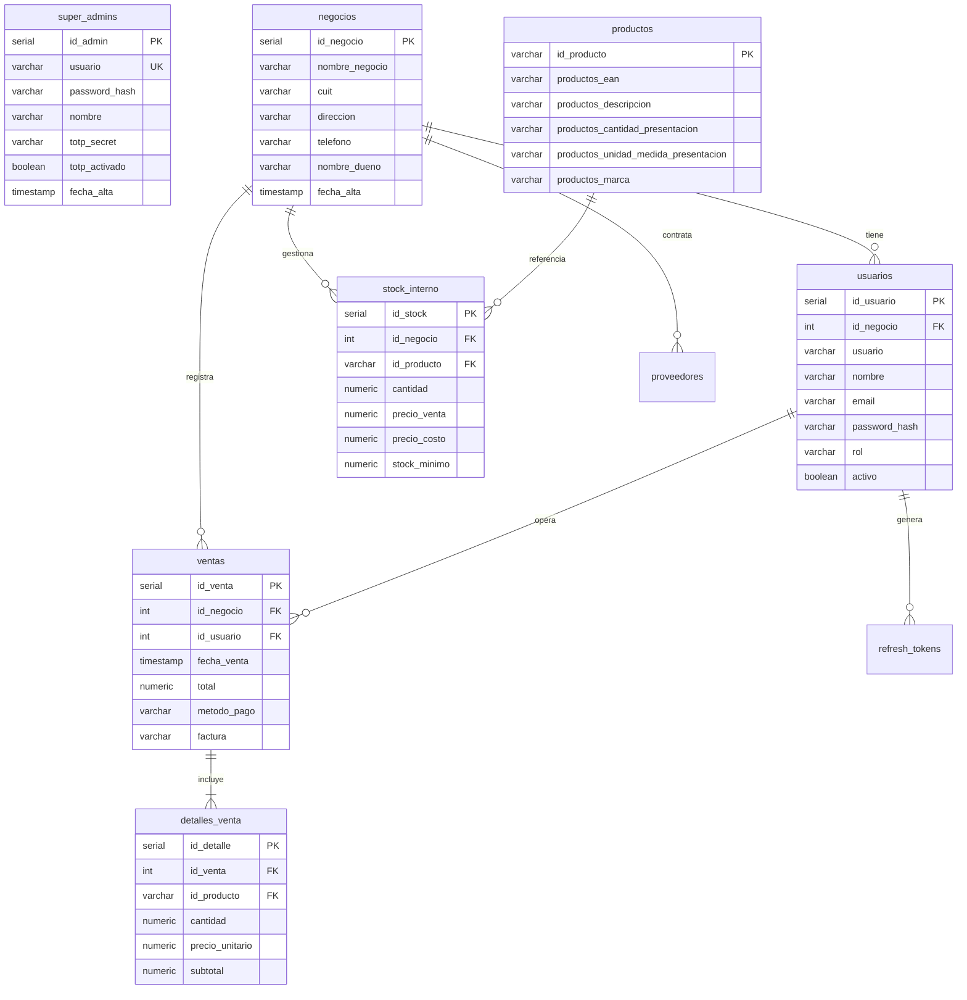

# StockAPP — Manual Técnico de Arquitectura, Uso y Despliegue

**Versión del Sistema:** 1.0.0 (Producción)  
**Fecha de Publicación:** Septiembre 2026  
**Documento Técnico Oficial**  

---

## 📋 Tabla de Contenidos
1. [Resumen Ejecutivo del Sistema](#1-resumen-ejecutivo-del-sistema)
2. [Stack Tecnológico](#2-stack-tecnológico)
3. [Arquitectura de Microservicios y Topología de Red](#3-arquitectura-de-microservicios-y-topología-de-red)
4. [Seguridad y Control de Acceso](#4-seguridad-y-control-de-acceso)
   - 4.1 Autenticación Multifactor (2FA / TOTP RFC 6238)
   - 4.2 Esquema de Tokens JWT y Refresh Tokens
   - 4.3 Túnel Seguro P2P con Tailscale
   - 4.4 Aislamiento Multitenant
5. [Modelo de Datos y Base de Datos (PostgreSQL 16)](#5-modelo-de-datos-y-base-de-datos-postgresql-16)
   - 5.1 Diccionario de Tablas Principales
   - 5.2 Catálogo Maestro Global (21.800+ Productos Argentinos)
6. [Manual de Uso por Rol](#6-manual-de-uso-por-rol)
   - 6.1 Rol SuperAdmin (Panel Web de Administración)
   - 6.2 Rol Dueño de Negocio (App de Escritorio)
   - 6.3 Rol Cajero (Punto de Venta / POS)
7. [Guía de Despliegue en Servidor (DevOps)](#7-guía-de-despliegue-en-servidor-devops)
   - 7.1 Archivos de Configuración
   - 7.2 Pasos de Instalación con Podman / Docker
   - 7.3 Creación de Administrador e Importación de Datos
   - 7.4 Políticas de Respaldo (Backups)

---

## 1. Resumen Ejecutivo del Sistema

**StockAPP** es una plataforma integral de gestión de inventario, punto de venta (POS) y facturación diseñada para pequeños y medianos comercios (kioscos, minimercados, almacenes, tiendas minoristas).

### Características Principales:
- **Arquitectura Cliente-Servidor Híbrida:** App de escritorio nativa de alto rendimiento emparejada con microservicios en la nube.
- **Catálogo Maestro Nacional:** Precargado con más de 21.800 productos argentinos con sus códigos EAN-13, marcas y descripciones, permitiendo a los comerciantes dar de alta su inventario en segundos mediante lector de código de barras.
- **Multitenant Estricto:** Cada negocio opera en un entorno de datos completamente aislado.
- **Conectividad Segura P2P:** Enlace directo y cifrado punto a punto mediante túneles WireGuard / Tailscale, eliminando la necesidad de abrir puertos inseguros hacia internet en los routers locales.
- **Doble Factor de Autenticación (2FA):** Consola de administración blindada con códigos TOTP compatibles con Google Authenticator y Authy.

---

## 2. Stack Tecnológico

| Componente | Tecnología | Versión | Rol en el Sistema |
|:---|:---|:---:|:---|
| **App Desktop** | Tauri + SvelteKit | Tauri 2.0 / Svelte 5 | Aplicación nativa de escritorio para Windows y Linux |
| **Diseño UI Desktop** | Vanilla CSS ("Patagónico") | Modern CSS | Paleta petróleo `#2e6e73`, tipografía Inter, SVGs puros |
| **Sidecar Local** | Go + tsnet | Go 1.25 | Proxy local embebido en el instalador que maneja el túnel Tailscale |
| **Gateway & Auth** | Node.js + Express + TS | Node 22 / Express 5 | Puerta de entrada pública, emisor de JWT, 2FA y proxy inverso |
| **Lógica de Negocio** | Go (ServeMux) | Go 1.25 | CRUD de productos, ventas, stock, facturación y reportes |
| **Base de Datos** | PostgreSQL (Alpine) | 16.15 | Motor relacional con aislamiento por `id_negocio` |
| **Panel de Administración**| Vue 3 + TypeScript + Vite | Vue 3.5 / Vite 6 | Panel web SPA para administración global y gestión de clientes |
| **Web Server Admin** | Nginx | 1.27 Alpine | Servidor web estático y proxy interno para el panel web |
| **Contenedores** | Podman / Podman Compose | 4.9+ / 5.8+ | Orquestación de infraestructura sin privilegios de root |

---

## 3. Arquitectura de Microservicios y Topología de Red

```
[ App Desktop Tauri v2 (Svelte 5) ] (:1420)
       │
       ▼ (Llamadas locales HTTP)
[ Sidecar Local Go (tsnet) ] (:9090)  [Solo en Producción]
       │
       ▼ 🔒 Túnel P2P Cifrado (Tailscale / WireGuard)
═══════════════════════════════════════════════════════════════════
                      SERVIDOR REMOTO (LINUX)
═══════════════════════════════════════════════════════════════════
[ stock-api ] Gateway Express/TS (:3000)
   ├── Autenticación de Usuarios (Login / Refresh / Logout)
   ├── Validación 2FA (TOTP RFC 6238) para SuperAdmin
   ├── Emisión y verificación de JWT (HS256)
   └── Control de Dispositivos (Máximo 4 terminales)
       │
       ├── (Proxy HTTP interno con cabecera Authorization)
       ▼
[ stock-operations ] Lógica de Negocio en Go (:8080)
   ├── Validación de Tokens por Introspección (/internal/session)
   ├── Catálogo Maestro Global (21.800+ productos)
   ├── Inventario Local por Negocio (stock_interno)
   ├── Registro de Ventas y Descuento Atómico de Stock
   └── Generación de Tickets y Facturación
       │
       ├── (Conexión TCP interna)
       ▼
[ PostgreSQL 16 ] Base de Datos Relacional (:5432)
       ▲
       │
[ front-admin ] Panel Web Administrativo (Vue 3 + Nginx) (:5173)
       └── Proxy Nginx interno /api/ ──> stock-api (:3000)
```

---

## 4. Seguridad y Control de Acceso

### 4.1 Autenticación Multifactor (2FA / TOTP)
La consola global de administración (`front-admin`) implementa el estándar **RFC 6238 (Time-based One-Time Password)**:
1. **Paso 1:** Validación de credenciales del SuperAdmin contra la tabla `super_admins` con `bcrypt` (10 salt rounds).
2. **Paso 2 (Onboarding):** En el primer inicio de sesión, el servidor genera un secreto criptográfico Base32 y su correspondiente **código QR en Data URL**. El usuario lo escanea con **Google Authenticator** o **Authy**.
3. **Paso 3 (Validación):** El usuario ingresa el código de 6 dígitos. El servidor valida la ventana temporal (tolerancia de ±30 segundos) y, una vez verificado, activa permanentemente `totp_activado = TRUE`.
4. **Token Administrativo:** Al completar el 2FA, se emite un JWT firmado con `rol: 'superadmin'`. Cualquier petición a rutas `/api/admin/*` sin este token y rol es rechazada con `401 Unauthorized` o `403 Forbidden`.

### 4.2 Esquema de Tokens JWT y Sesiones
- **Access Token:** JWT firmado con algoritmo `HS256`, expiración corta de **15 minutos**. Incluye `sub` (id_usuario), `negocio` (id_negocio), `rol` ('dueño', 'cajero' o 'superadmin') y `permisos`.
- **Refresh Token:** Cadena aleatoria criptográfica de 32 bytes (`crypto.randomBytes(32)`), almacenada en la base de datos con hash **SHA-256**, expiración de **30 días** y **rotación obligatoria** en cada uso.

### 4.3 Control de Terminales (Límite de 4 Dispositivos)
Cada negocio tiene un límite estricto de hasta **4 terminales activas simultáneas**:
- Cada terminal genera un `device_id` persistente UUID v4.
- Al iniciar sesión o registrar el dispositivo, el servidor valida el cupo en la tabla `dispositivos_clientes`.
- El SuperAdmin puede desvincular terminales remotamente desde el panel web si el cliente cambia de computadora.

---

## 5. Modelo de Datos y Base de Datos (PostgreSQL 16)

### 5.1 Diccionario de Tablas Principales



---

## 6. Manual de Uso por Rol

### 6.1 Rol SuperAdmin (Panel Web de Administración)
- **Acceso:** `http://<IP_TAILSCALE>:5173` o subdominio privado.
- **Autenticación:** Usuario + Contraseña + Código de 6 dígitos de Google Authenticator.
- **Funcionalidades:**
  1. **Dashboard:** Métricas globales (Total de Negocios, Clientes Activos, Dispositivos Vinculados).
  2. **Alta de Negocios:** Creación de nuevos inquilinos definiendo nombre, CUIT, dueño y credenciales iniciales.
  3. **Gestión de Terminales:** Visualización y desvinculación de computadoras conectadas por negocio.
  4. **Seguridad:** Reseteo de contraseñas de dueños de negocio.

### 6.2 Rol Dueño de Negocio (App Desktop)
- **Acceso:** Aplicación de escritorio StockAPP con usuario de rol `dueño`.
- **Funcionalidades:**
  1. **Stock e Inventario:**
     - Búsqueda en el Catálogo Maestro de 21.800 productos.
     - Asignación de precio de venta, costo y stock mínimo.
     - Modo Carga Masiva con lector de código de barras.
  2. **Gestión de Empleados:** Creación y gestión de cajeros con turnos y permisos.
  3. **Finanzas y Reportes:**
     - Resumen de caja diaria, semanal y mensual.
     - Total facturado, métodos de pago (Efectivo, Tarjeta, Transferencia).
     - Facturación de ventas (Factura C / Monotributo).

### 6.3 Rol Cajero (Punto de Venta / POS)
- **Acceso:** Aplicación de escritorio StockAPP con usuario de rol `cajero`.
- **Funcionalidades:**
  1. **Pantalla de Ventas:**
     - Escaneo continuo de artículos mediante lector de código de barras EAN.
     - Modificación rápida de cantidades y precios por unidad o peso.
  2. **Cobro y Ticket:**
     - Selección de método de pago.
     - Cálculo automático de vuelto / cambio.
     - Emisión e impresión del ticket de compra.

---

## 7. Guía de Despliegue en Servidor (DevOps)

### 7.1 Requisitos del Servidor
- **Sistema Operativo:** Ubuntu 22.04 / 24.04 LTS o Fedora Server.
- **Herramientas:** `podman`, `podman-compose` (o `docker compose`), `tailscale`.
- **Puertos Requeridos:**
  - Internos: 5432 (Postgres), 8080 (Go) — *no expuestos a internet*.
  - Expuestos: 3000 (API Gateway), 5173 (Panel Web Admin).

### 7.2 Archivo `docker-compose.prod.yml`
El archivo orquesta los 4 contenedores en la red bridge aislada `stockapp_network`:
```bash
podman-compose -f docker-compose.prod.yml up -d --build
```

### 7.3 Creación del Administrador e Inicialización
```bash
# 1. Crear el SuperAdmin con contraseña hasheada:
podman exec -it stockapp_gateway npm run crear-admin:prod

# 2. Cargar el Catálogo Maestro (21.800+ productos):
cd ~/stockapp/backend/services/stock-operations
podman run --rm --network stockapp_network \
  -v $(pwd):/app:ro -w /app \
  -e DB_HOST=postgres -e DB_USER=stock_admin -e DB_PASSWORD=... -e DB_NAME=stock_db \
  docker.io/library/golang:1.25-alpine go run pkg/importar_db.go
```

### 7.4 Estrategia de Backups Automáticos
Crear una tarea cron diaria en el servidor (`sudo crontab -e`):
```bash
0 3 * * * podman exec stockapp_db pg_dump -U stock_admin stock_db | gzip > /var/backups/stockapp/db_$(date +\%Y\%m\%d).sql.gz
```
Esto genera un respaldo comprimido diario a las 03:00 AM con retención histórica.
